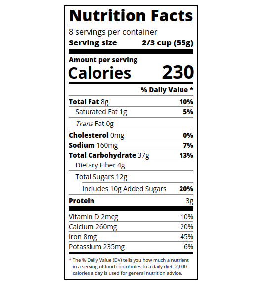

The provided HTML code represents a simplified nutrition label with basic typography styling. It utilizes the "Open Sans" font family with different font weights (400, 700, and 800) for different elements. Headers have a bold font weight (800), and paragraphs have a default font size of 16px. Certain elements, such as nutrient names and percentage values, are highlighted using the "bold" class. Horizontal dividers are used to visually separate sections, and a note at the bottom provides additional information in a smaller font size (0.6rem).